# Avni Clan
The aim of our project is to inspire people to collaborate and work with one another, in order to build a greener future for the whole world. Through activities and events that promote more sustainable habits, users can connect and heal their environment bit by bit.

## Screenshots

### Home page:
Live Air Quality Statistics -

Ongoing & upcoming Events -
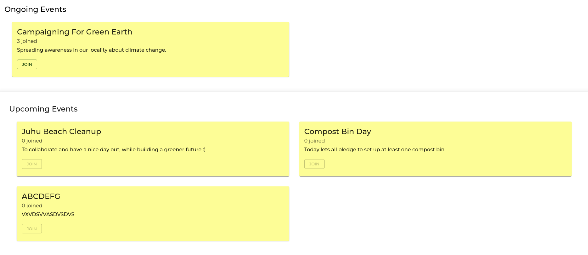

Leaderboard -
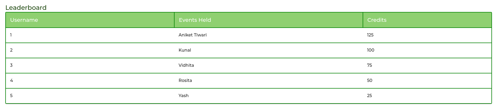

### Sign up:
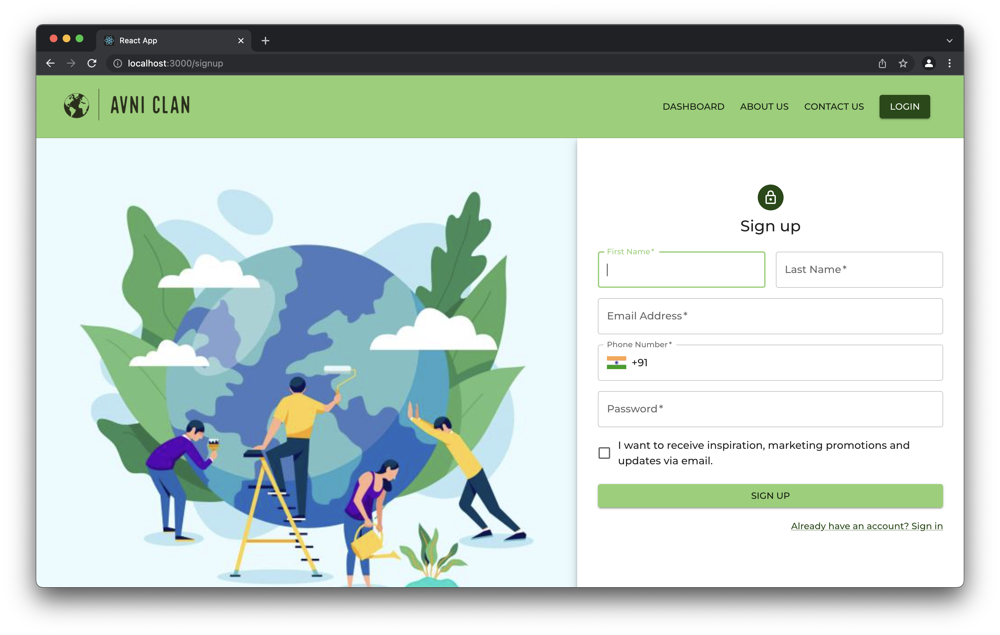

### Login:
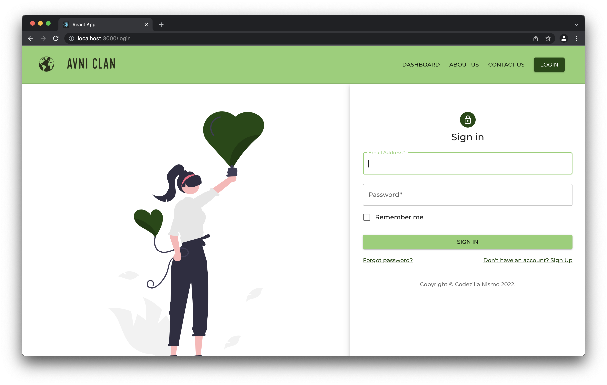

### Forgot Password:
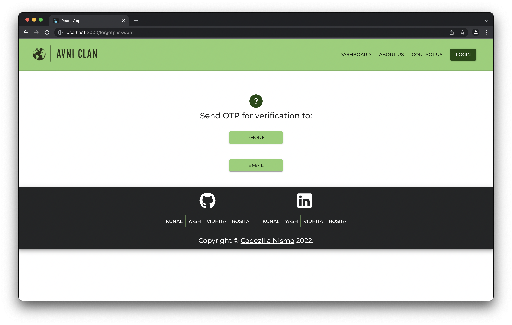

### Payment Integration:

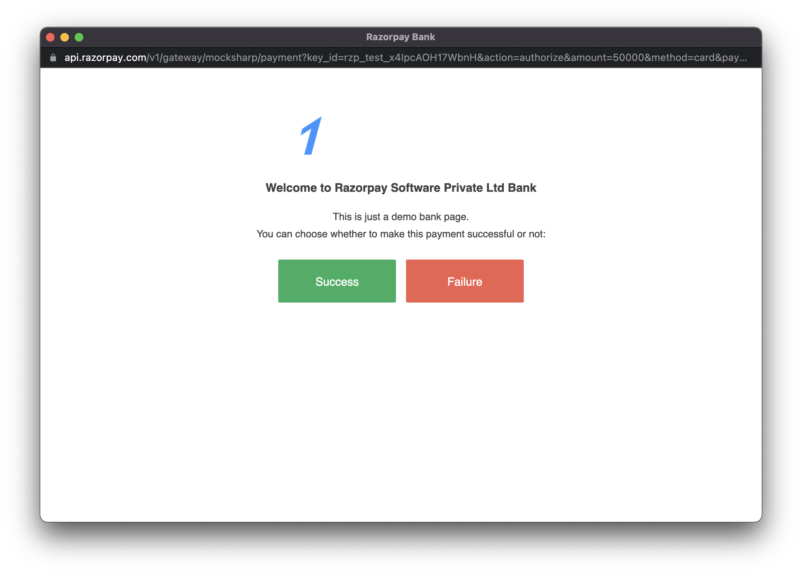

### About Us:

### Dashboard
Normal Dashboard -
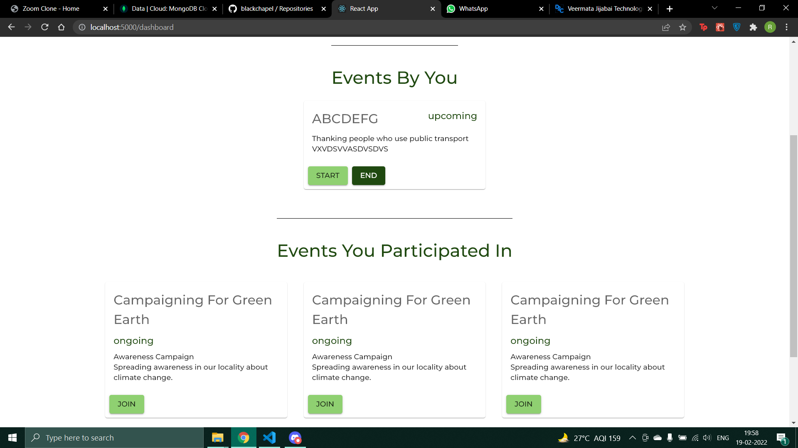

On opening sidebar -
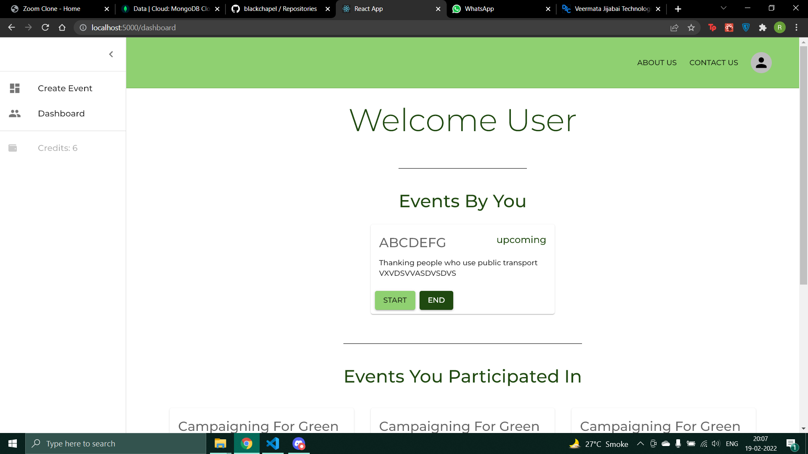

### Create Event -
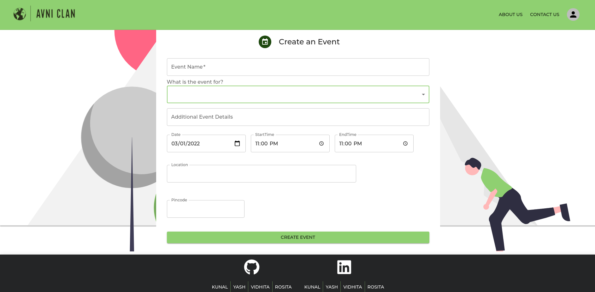

### Webcam Recording -
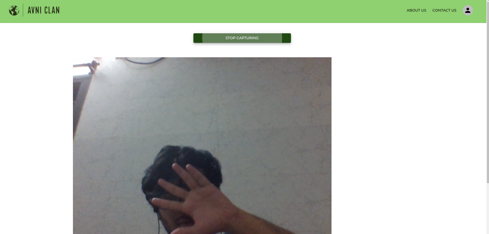

### Download the recording -
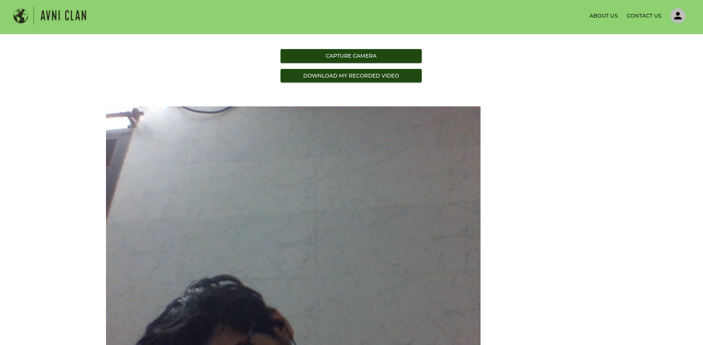

## Contributors
Kunal C. - https://github.com/blackchapel

Rosita Dmello - https://github.com/rosita-dmello

Vidhita Pai - https://github.com/vidhitapai

Yash Brahmbhatt - https://github.com/Yashpb1513
