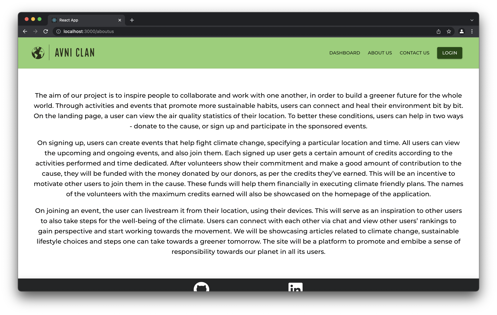

# Avni Clan
The aim of our project is to inspire people to collaborate and work with one another, in order to build a greener future for the whole world. Through activities and events that promote more sustainable habits, users can connect and heal their environment bit by bit.

## Screenshots

### Home page:
Live Air Quality Statistics -

Ongoing Events -

Upcoming Events -

Leaderboard -

### Sign up:

### Login:

### Forgot Password:

### Payment Integration:

### About Us:

### Dashboard
Normal Dashboard -

On opening sidebar -

### Create Event -

### Join Event -

### Webcam Recording -

### Download the recording -

## Contributors
Kunal C.

Rosita Dmello

Vidhita Pai

Yash Brahmbhatt
